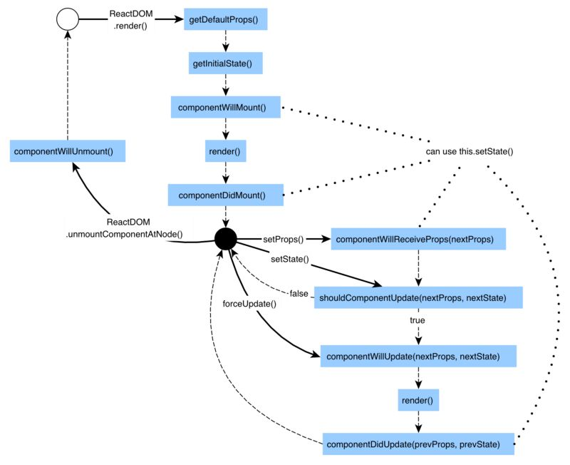

# React 专题

__前言：__
React的生态圈很大，很有野心，要好好学

## 原理层

### snabbdom体验虚拟dom与diff算法

>snabbdom 基本使用，控制台查看更新部分

```HTML
<!DOCTYPE html>
<html lang="en">

<head>
    <meta charset="UTF-8">
    <meta name="viewport" content="width=device-width, initial-scale=1.0">
    <meta http-equiv="X-UA-Compatible" content="ie=edge">
    <script src="https://cdn.bootcss.com/jquery/3.3.1/jquery.min.js"></script>
    <script src="https://cdn.bootcss.com/snabbdom/0.7.1/snabbdom.js"></script>
    <script src="https://cdn.bootcss.com/snabbdom/0.7.1/snabbdom-class.js"></script>
    <script src="https://cdn.bootcss.com/snabbdom/0.7.1/snabbdom-props.js"></script>
    <script src="https://cdn.bootcss.com/snabbdom/0.7.1/snabbdom-style.js"></script>
    <script src="https://cdn.bootcss.com/snabbdom/0.7.1/snabbdom-eventlisteners.js"></script>
    <script src="https://cdn.bootcss.com/snabbdom/0.7.1/h.js"></script>
    <title>Document</title>
</head>

<body>
    <div id="container"></div>
    <button id="btn-change">change</button>
    <script>
        var snabbdom = window.snabbdom;
        //定义patch
        var patch = snabbdom.init([
            snabbdom_class,
            snabbdom_props,
            snabbdom_style,
            snabbdom_eventlisteners
        ]);
        //定义h函数
        var h = snabbdom.h;

        var container = document.getElementById('container');
        //生成 vnode
        var vnode = h('ul#ist', {}, [
            h('li.item', {}, 'Item1'),
            h('li.item', {}, 'Item2')
        ]);
        patch(container, vnode);

        document.getElementById('btn-change').addEventListener('click', function () {
            var newVnode = h('ul#ist', {}, [
                h('li.item', {}, 'Item1'),
                h('li.item', {}, 'ItemB'),
                h('li.item', {}, 'Item3')
            ]);
            patch(vnode,newVnode);
        })
    </script>
</body>

</html>
```

>snabbdom 与jQuery效果对比（复杂建表）

```HTML
<!DOCTYPE html>
<html lang="en">

<head>
    <meta charset="UTF-8">
    <meta name="viewport" content="width=device-width, initial-scale=1.0">
    <meta http-equiv="X-UA-Compatible" content="ie=edge">
    <script src="https://cdn.bootcss.com/jquery/3.3.1/jquery.min.js"></script>
    <script src="https://cdn.bootcss.com/snabbdom/0.7.1/snabbdom.js"></script>
    <script src="https://cdn.bootcss.com/snabbdom/0.7.1/snabbdom-class.js"></script>
    <script src="https://cdn.bootcss.com/snabbdom/0.7.1/snabbdom-props.js"></script>
    <script src="https://cdn.bootcss.com/snabbdom/0.7.1/snabbdom-style.js"></script>
    <script src="https://cdn.bootcss.com/snabbdom/0.7.1/snabbdom-eventlisteners.js"></script>
    <script src="https://cdn.bootcss.com/snabbdom/0.7.1/h.js"></script>
    <title>Document</title>
</head>

<body>
    <div id="container"></div>
    <button id="btn-change">change</button>
    <script>
        //要解释清除什么是virtualdom 和常见api和举例
        var snabbdom = window.snabbdom;
        //定义patch
        var patch = snabbdom.init([
            snabbdom_class,
            snabbdom_props,
            snabbdom_style,
            snabbdom_eventlisteners
        ]);
        //定义h函数
        var h = snabbdom.h;
        var data = [
            {
                name: '姓名',
                age: '年龄',
                address: '地址'
            },
            {
                name:'张三',
                age:'20',
                address:'北京'
            },
            {
                name:'李四',
                age:'21',
                address:'上海'
            },
            {
                name:'王五',
                age:'23',
                address:'广州'
            }
        ];
        var container = document.getElementById('container');
        //渲染函数
        var vnode;
        function render(data){
            var newVode = h('table', {},data.map(function(item) {
                var tds = [];
                for(var i in item){
                    if(item.hasOwnProperty(i)){
                        tds.push(h('td', {},item[i]+''));
                    }
                }
                return h('tr', {}, tds);
            }));

            if(vnode) {
                //re-render
                patch(vnode,newVode);
            }else {
                //初次渲染
                patch(container,newVode)
            }
            vnode = newVode;
        }
        render(data);
        var btnchange = document.getElementById('btn-change');
        btnchange.addEventListener('click',function() {
                data[1].age = 30;
                data[2].address = '深圳';
                render(data);
        })
    </script>
</body>

</html>
```

>patch初次渲染示意

```js
//将vnode添加到container中，也就是转换vnode为真实dom元素过程
// vdom:
// {
//     tag:'ul',
//     attrs: {
//         id: 'list'
//     },
//     children: [
//         {
//             tag: 'li',
//             attrs: {
//                 className: 'item'
//             },
//             children:['Item 1'];
//         }
//     ]
// }

// dom:
// <ul id='list'>
//     <li class='item'>Item 1</li>
// </ul>

function createElement(vnode){
    var tag = vnode.tag;
    var attrs = vnode.attrs || {};
    var children = vnode.children || [];
    if(!tag){
        return null;
    }

    //创建元素
    var elem = document.createElement(tag);
    //属性
    for(var i in attrs){
        if(attrs.hasOwnProperty(i)){
            elem.setAttribute(i,attrs[i]);
        }
    }
    //子元素
    children.forEach(function (childVnode) {
        //给elem添加子元素
        ele.append(createElement(childVnode));
    });
    //返回真实的DOM元素
    return elem;
}
```

>patch再次渲染示意

```js
vdom:
// {
//     tag:'ul',
//     attrs: {
//         id: 'list'
//     },
//     children: [
//         {
//             tag: 'li',
//             attrs: {
//                 className: 'item'
//             },
//             children:['Item 1'];
//         }
//     ]
// }
// newvdom:
// {
//     tag:'ul',
//     attrs: {
//         id: 'list'
//     },
//     children: [
//         {
//             tag: 'li',
//             attrs: {
//                 className: 'item1'
//             },
//             children:['Item 1'];
//         },
//         {
//             tag: 'li',
//             attrs: {
//                 className:'liao';
//             },
//             children:['bulaili'];
//         }

//     ]
// }
function updateChildren(vnode,newVnode){
    var children = vnode.children || [];
    var newChildren = newVnode.children || [];
    children.forEach(function (child,index) {
            var newChild = newchildren[index];
            if(child.tag == newChild.tag){
                 updateChildren(child,newChild);
            }else{
                replaceNode(child,newChild);
            }
    })
}
function replaceNode(vnode,newVode) {
    var elem = vnode.elem;
    var newelem = createElement(newVode);
}
```

### React的diff算法和虚拟Dom

>什么是diff算法

    就是一个比较不同的算法早在linux就有，在线也有，显示两个文本文件的差异
>vdom为何用diff算法

    因为dom操作是昂贵的，所以我们只需要找出必须修改的部分，找出就要用diff算法
>diff算法的实现流程

    patch(container,vnode)
    patch(vnode,newVnode)
>virtualdom是什么？为什么要用？

    虚拟DOM，用js来模拟dom结构；将dom对比操作放在js层，提高效率
>

### React和Vue的异同和特点

>不同点

    两者的本质区别：
             vue本质是MVVM框架，由MVC框架形成,而React本身只是view层他需要结合redux等库形成自己的生态
             React本质是前端组件化框架，由后端组件化进化而来（php smarty)（vue可强行支持组件化）
             vue支持双向数据绑定，而React是单向数据流（当然也可以双向数据绑定只是没有那么方便)
    模版的区别：vue（最初由angular推出）
          React-使用JSX
    使用起来学习成本低，比较符合js，而vue要学v-if v-for 之类（虽然vue模版分离比较好吧）
    个人觉得数据变化与数据驱动，React靠的是props和state
    而vue是data(),父子通信的时候子节点$emit('toggle',state)向上有点儿像冒个泡的感觉然后父组件用@toggle这种内嵌属性去做节点监听

>共同点

    1、都支持组件化
    2、数据驱动视图
    3、vue2.0也是支持jsx的，其实我觉得两种框架都差不多。。
    4、数据部分基本都放在组件顶层，较为统一

>国内使用情况

    1、国内vue文档易读易学，滴滴专门vue，社区强大
    2、react适合团队水平高的

### React组件化
> 说一下对组件化的理解

    两点：封装与复用，很像面向对象，封装继承多态
         封装：封装视图与数据和变化逻辑即数据驱动视图变化
         复用：通过props值不同进行传递

### jsx相关

>特点总结

```txt
1、js可以调用html元素，html元素可以通过{}读取外面的值，就像父子关系
2、js的函数function 就像是一个xml，可以形成html标签,但注意此时返回的也是一个html标签
3、xml标签属性引入其他xml标签时也要加入{}
4、jsx引入css也是引用js对象
5、jsx中用classNmae代替class
6、jsx非react独有 已经独立（只是由react引入）
```

>JSX与vdom的关系

    vdom由react初次推广，结合JSX
    JSX是模版最终渲染成html
    初次渲染+修改state后的re-render正好符合vdom的使用场景
    简单说就是JSX-》js -》vnode(数据驱动视图)
    
>JSX本质是什么

    JSX语法（标签，js表达式，判断，循环事件绑定）
    语法糖，需要在本地被解析成js才行，自然无法在浏览器端运行（vue的模版也要被解析成js），
    解析后的形式是React.createElement(),和h函数的参数非常像
    一种独立标准，可被其他项目使用
    
### React状态

>说一下setState的过程

    setState即re-render即类似触发patch(vnode,newVnode)的过程，
    （render相当于patch(container,vnode);React.createElement->render~~patch(container,vnode)

>setState的异步

```js
setState类setTimeout 会加入事件队列，
addTitle(title) {
    const currentList = this.state.list;
    console.log(this.state.list);//['a','b']
    this.setState({
        list: currentList.concat(title);
    });
    console.log(this.state.list); //['a','b']
}
```

>使用异步的原因：

    1、可能会一次执行多个setState
    2、无法规定限制用户使用
    3、没必要每次setState都重新渲染，考虑性能
    4、即使是每次重新渲染，用户也看不到其中的效果
    所以多个setState在执行的时候直接最后一次赋值会覆盖前面的操作

>setState的过程(当组件的setState函数被调用之后，发生了什么？)：

    每个组件实例都有renderComponent方法
    执行renderComponent重新执行实例的render
    render函数返回newVnode 然后拿到preVnode
    执行patch（preNode,newVnode)

### 个人对setState的思考

本篇主要是对《深入React技术栈》那部分对于setState的拓展吧。。

先就原代码再进一步拓展

```js
import React from 'react';
import ReactDOM from 'react-dom';

class Example extends React.Component {
  constructor() {
    super()
    this.state = {
      value: 0
    }
  }

  componentDidMount() {
    this.setState({ value: this.state.value + 1 })
    console.log(this.state.value) // 第一次输出
    this.setState({ value: this.state.value + 1 })
    console.log(this.state.value) // 第二次输出
    setTimeout(() => {
      this.setState({ value: this.state.value + 1 })
      console.log(this.state.value) // 第三次输出
      this.setState({ value: this.state.value + 1 })
      console.log(this.state.value) // 第四次输出
    }, 0);
    this.refs.button.addEventListener('click', this.click)
  }

  click = () => {
    this.setState({ value: this.state.value + 1 })
    this.setState({ value: this.state.value + 1 })
    console.log(this.state.value);
  }

  render() {
    return (
      <div><span>value: {this.state.value}index: </span>
        <button ref="button" onClick={this.click}>点击</button>
      </div>
    )
  }
}
ReactDOM.render(
  <Example />,
  document.getElementById('root')
)
//输出是：0 0 2 3 点击之后输出5 5 最后显示在页面上的value为6
```

这是一个比较复杂的情况我觉得，分为onclick、setTimeout事件外，和事件内两种情况。

>第一类：直接在componentDidMount里执行的两次setState

两次操作在同一次调用栈中执行，React组件渲染到DOM的过程就在一个大的事务(wrapper)里,所以在这个生命周期里调用setState时batchingStrategy的isBatchingUpdates已经被设为true了，两次操作因此没有立即生效，而是被放进了dirtyComponents里，新的state还没被应用到组件中，等回头在队列里执行后，这个过程是异步过程。

>第二类：setTimeout事件内的两次setState

这一次不在React的“大事务”之内，没有前置的batchedUpdate调用，所以batchingStrategy的isBatchingUpdates为false，因此这样的话setState会立即生效，即类似同步过程，两行setState的this.state.value是一样的相当于是重复操作。因此如果我们把setTimeout里面的第三次输出和第四次输出之间的+1变成+2就会输出0 0 2 4；

>第三类：两个附加click事件的setState

这个输出非常之谜，0 0 2 3 点击按钮之后的输出是5 5 ，react官方对此的看法是setState本身都不一定是固定的同步异步这个和实际场景有关，也就是说，如果我们在框架的设计理念内去使用它，得到的就是可控的结果，如果非要游走在框架之外，答案就可能扑朔迷离。。。

原文大佬的解释：

关于setState ,我们首先要有个正确的认识，官网中给出的解释是setState不是保证同步的

这说明它有时候是同步的有时候的异步的，那什么时候是同步，什么时候是异步？

答案是在React库控制之内时，它就会以异步的方式来执行，否则以同步的方式执行。

但大部份的使用情况下，我们都是使用了React库中的组件，例如View、Text、Image等等，

它们都是React库中人造的组件与事件，是处于React库的控制之下，在这个情况下，

setState就会以异步的方式执行。一般理解为this.state的值会在DOM中渲染，其他的情况比如取token,作为接口的参数的你setState是同步的

ps:如果第三类情况是可以讲的通的，请路过大佬批评教育orz

### React-router 路由的实现原理（感觉不是很透彻，回头有空看看源码写个博文）

基本原理（嗯。。。）：view和URL保持同步，用户在Web界面进行操作时的变化会记录在浏览器的历史记录里，通过交互或手动输入的方式，同步或异步向服务端发送请求获取资源，重新绘制UI.

### 其他：

React.createElement相对于h增加了对自定义组件构造函数的考虑：解析过程：初始化实例后render

____

## React应用层

### React 使用场景

组件化开发适用于较复杂的系统开发，轻且快、只是一个v，需要和其他的router库等配合使用，本身并不像angular那样是个完整的生态。

### React 生命周期

React组件从广义上可份挂载、渲染、卸载几个阶段，生命周期可分为两类

* 当组件挂载或者卸载时

* 组件接受到新数据而渲染时



### 实现组件有哪些方式

* React.createClass:最传统、兼容性最好的方法，一直都是react官方唯一指定的组件写法,调用几次button就会创建几次button实例

```js
const Button = React.createClass({
    getDefaultProps(){
        return {
            color:'blue',
            tet:'Confirm'
        };
    },
    render() {
        const { color, text} = this.props;
        return (
            <button className={`btn-${color}`}>
                <em>liao</em>
            </button>
        )
    }
})
```

* es 6 classes： 就是用类来实现，调用类实现的组件会创建实例对象。

```js
import React from 'react';
import ReactDOM from 'react-dom';
import Index from './components/index';
import Content from './components/content';
import Demo from './components/demo';
import About from './components/about';
import {HashRouter as Router,Route,Link} from 'react-router-dom';
import 'antd/dist/antd.css';
require('es6-promise').polyfill();

class Root extends React.Component{
    render(){
        return (
                <Router>
                        <div>
                            <Route exact path="/" component={Index} />
                            <Route path="/contents/:num" component={Content} />
                            <Route path="/tags/:tagName" component={Index} />
                            <Route path="/demos" component={Demo} />
                            <Route path="/about" component={About} />
                        </div>
                </Router>
        );
    }  
}

ReactDOM.render(<Root />, document.getElementById('root'));
```

* 无状态函数：该种组件又叫无状态组件，创建时始终保持了一个实例，避免了不必要的检查和内存分配，只传入props和context两个参数，不存在state与生命周期,官方也很推崇。

```jsx
function Button({ color = 'blue',text = 'Confirm' }){
    return (
        <button className = {`btn-${color}`}>
            <em>liao</em>
        </button>
    );
}
```

### shouldComponentUpdate函数有什么作用？

组件自身state更新时会依次执行shouldComponentUpdate、componentWillUpdate、componentDidUpdate,他是一个特别的方法，接收需要更新的props和state，使在必要时更新，不需要时不更新，因此当方法返回flase时，组件不再向下执行生命周期方法。它不一定总会起到性能优化的作用，因为虽然是"重点"比较（就是不是所有属性都进行比较）,但是比较的过程仍然相当耗时不一定比优化的效果好
[大佬实际测量](https://blog.csdn.net/u012937029/article/details/76522930)

### 为什么循环产生的组件中要利用上key这个特殊的prop？

因为不用会报警啊。。。这个有点讨厌，但实质上就是用来标示当前项的唯一性的props，有点儿像数据库里的id

### 受控组件(Controlled Component)与非受控组件(Uncontrolled Component)的区别

#### 受控组件：

每当表单的状态发生变化时，都会被写入组件的state中，这种组件在React中成为受控组件。更新state流程一般是:初始state中设置表单默认值->表单变化调用onChange事件处理器->通过合成e，拿到改变状态，更新state->setState触发视图重新渲染。props传入，onchange写回state这就完成了数据双向绑定

#### 非受控组件：

没有value props，使用defaultValue和defaultChecked prop来表示组件的默认状态，值不受组件自身state和props控制，虽然性能损耗相对低一点，但是不提倡使用它，而是用Flux/Redux应用架构等方式达到同一组件状态的目的

### refs 是什么?

React组件中非常特殊的prop，可以附加到任何一个组件上。组件被调用时会新建一个该组件的实例，而refs就会指向这个实例。

```js
...
<div ref={(node) => this.node = node}>

//这里取的的node既是实例也是原生的DOM
```

我们也可以把它和findDOMNode配合使用来获取原生DOM

```js
componentDidMount(){
    const myDiv = this.refs.myDiv;
    const myDom = ReactDOM.findDOMNode(myDiv);
}
render(){
    return (
        <div ref="myDiv">
    );
}
```

### React组件性能优化与immutable.js实现原理

### 对redux的理解

[阮一峰老师教程](http://www.ruanyifeng.com/blog/2016/09/redux_tutorial_part_one_basic_usages.html)

---

参考书：深入React技术栈